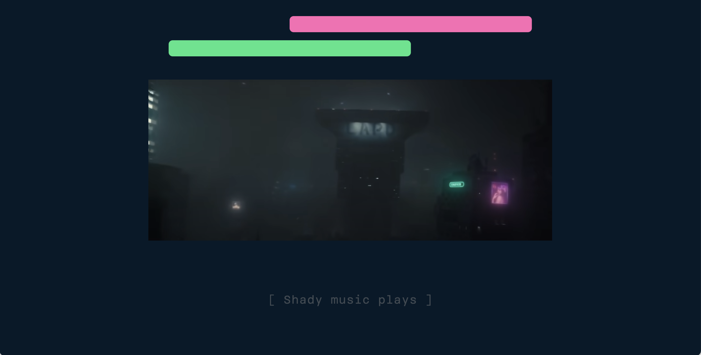

# Web Typography, 2020/2021

### Ontwerper:
Carmen Rozendaal, 500823349

# Over de film

  
Ik ben aan deze opdracht begonnen door de film *Blade Runner 2049* op Prime te bekijken. Ik wilde weten waar de film over ging, hierdoor kon ik ook de gegeven fragmenten beter begrijpen. Ook kon ik zo ontdekken wat de sfeer van de film, en het karakter van de personages was. 

  De verhaallijn van de film was best prima, maar de uitwerking ervan kon wat mij betreft beter. Ten eerste was de film erg lang en waren bepaalde scenes vrij sloom verfilmt, waardoor de spanning wegzakte. Ook zag je sommige personages, die best een belangrijke rol speelde in de film, soms maar weinig. 

  Wat me opviel aan de film was, dat ze veel aandacht hebben besteed aan de wereld waarin de film zich afspeeld, dit zat goed in elkaar. Ook ging het vooral om de hoofdpersonage, deze zag je dan ook voornamelijk. Je werd meegenomen in zijn gedachtes en emoties en leerde hem ook naarmate de film, steeds beter kennen. 
  

## Typografische restricties
Ik heb besloten om het font Brenner te gebruiken. Dit heb ik gedaan, omdat ik wil dat iedereen mijn ontwerp in de juiste staat kan bekijken. Met het systeemfont vond ik het toch tricky, dat deze zou kunnen worden aangepast of dat hij telkens zou veranderen.

De keuze voor Brenner is ook omdat ik in mijn ontwerp de verschillende stemmen wil benadrukken. Het is daarom makkelijk om hier een uitgebreid font-family voor te kunnen gebruiken. Zo zou de robotstem bijvoorbeeld in MONOSPACE kunnnen staan, terwijl de stem van AGENT K in Regular is. Met Brenner kan ik meer verschil aanbrengen in stijl, en dat vond ik voor deze opdracht erg geschikt. 

### Mijn idee: 
De elementen uit de omgeving van de film, ook laten zien op de achtergrond van het scherm. Met het doel om zo het visuele aspect extra te benadrukken, aangezien dit het enige is wat de gebruiker ervaart. Ik wil dit dus extra versterken.
Ook ga ik de belangrijke geluiden, die essentieel zijn in de film, visueel maken om zo het gevoel hiervan te laten overkomen. 
 

## Voortgang - Week 1

  
Opstartface

  De start van de opdracht ging een beetje moeizaam, ik vond het lastig om te bepalen in wat voor soort stijl ik de geluids-elementen wilden vormgeven. Ook had ik nog niet precies voor ogen welke geluiden er precies waren of waar ik me nou op wilde focussen.
  
  Ik ben daarom als 1e begonnen met het stijlen van de voices, dit waren er 4: Een robotstem, Agent K, een voorbijganger en een collega. Ik heb hiervoor het Brenner-Font goed kunnen inzetten.
  - De robotstem is gestylt in Monospace, dit vond ik passend aangezien het een computer is. 
  - Agent K heeft het Sans-Regular font, aangezien hij een vrij normaal personage is. 
  - De voorbijganger heeft het Brenner Sans Condensed lettertype, dit vond ik het meest passend aangezien hij op een gemene toon praat. En bij dit lettertype staan alle letters wat strak op elkaar.
  - De collega heeft ook het Sans-Regular font.  

  Bij het stijlen van de voices wilde ik de kijker laten weten wie wat zegt, daarom heb ik dan ook de naam van de spreker toegevoegd aan de tekstregel. (Voorbeeld, Agent K: *Yes sire*).

  Vervolgens ben ik gaan kijken naar de geluidseffecten in de video, en heb ik die voor mezelf in een overzicht gezet, op de juiste tijd. 

  
Vormgevingskeuze

  
  - Voor de achtergrond heb ik gekozen voor donkerblauw. Ik ben niet voor zwart gegaan, aangezien het dan te donker zou worden. Het fragment zelf was ook al vrij donker en ik wilde wel dat de kijker het nog kon zien. 

  - Aan het begin van de video zie je neonlichten in de stad, wat karakter geeft aan de omgeving waarin de personage zich bevind. Daarom heb ik besloten deze extra uit te lichten en ze ook op de achtergrond als soort lazerstralen te tonen. Dit geeft het ook een spannend effect en vond ik passend bij het 'space geluid' wat je hoorde.

  

  - Dit heb ik ook bij de sirene gedaan die je hoort. De lichten daarvan heb ik op de achtergrond geprojecteerd en ook zie je het icoon van een sirene verschijnen.

  

  - Vervolgens heb ik bij het horen van een alarm, een rode gradient gebruikt als achtergrond en springt het beeld naar voren. Ook zie je het woord [ Alarm ] , deze heb ik binnen haakjes gezet zodat de kijker ziet dat het om een geluid gaat.
  Wanneer een alarm heftiger wordt heb ik daar een icoon aan toegevoegd, dit benadrukt de ernst van het geluid. 

  

## Voortgang - Week 2

  
Mijn proces

  
  ### Bevinding 1:
  Hier komt nog tekst.

  
  
  

## Eindresultaat

  
Mijn eindontwerp

  
  ### Bevinding 1:
  Hier komt nog tekst.

  

## Reflectie

  
Persoonlijke ontwikkeling

  ### Dit ging goed/Heb ik geleerd: 
  Hier komt nog tekst.

  

  ### Dit was lastig/Is niet gelukt:
  Hier komt nog tekst.

  

## Bronnenlijst

1. bron 1: https://giphy.com (gif achtergrond 1)
2. bron 2: https://media.giphy.com (gif achtergrond 2)

