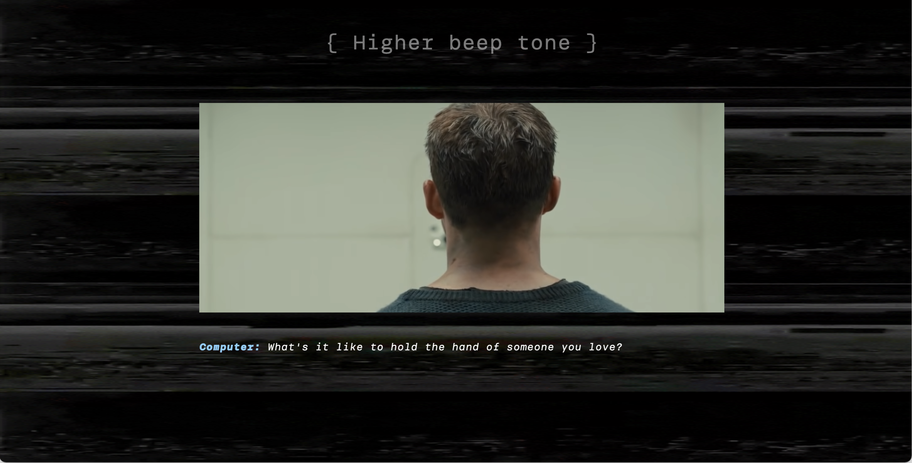

# Web Typography, 2020/2021

### Ontwerper:
Carmen Rozendaal, 500823349

# Over de film

  
Ik ben aan deze opdracht begonnen door de film *Blade Runner 2049* op Prime te bekijken. Ik wilde weten waar de film over ging, zodat ik hierdoor de gegeven fragmenten beter kon begrijpen. Ook wilde ik ontdekken wat de sfeer van de film was, en zien hoe het karakter van de personages zich uitte. 

  De verhaallijn van de film was best prima, maar de uitwerking ervan kon wat mij betreft beter. Ten eerste was de film erg lang en waren bepaalde scenes vrij sloom verfilmt, waardoor de spanning wegzakte. Ook zag je sommige personages, die best een belangrijke rol speelde in de film, soms maar weinig (zoals de badguy). 

  Wat me opviel aan de film was, dat ze veel aandacht hebben besteed aan de wereld waarin de film zich afspeeld, dit zat goed in elkaar. Ook ging het vooral om de hoofdpersonage, deze zag je dan ook voornamelijk. Je werd meegenomen in zijn gedachtes en emoties en leerde hem ook naarmate de film, steeds beter kennen. 
  

## Keuze voor typografie
Ik heb besloten om het font Brenner te gebruiken. Dit heb ik gedaan, omdat ik wil dat iedereen mijn ontwerp in de juiste staat kan bekijken. Met het systeemfont vond ik het toch een risico dat deze zou kunnen worden aangepast of dat hij zou kunnen veranderen.

De keuze voor Brenner is ook, omdat ik in mijn ontwerp de verschillende stemmen wil benadrukken. Het is daarom makkelijk om hier een uitgebreid font-family voor te kunnen gebruiken. Zo zou de robotstem bijvoorbeeld in MONOSPACE kunnnen staan, terwijl de stem van AGENT K in Regular is. Met Brenner kan ik meer verschil aanbrengen in stijl, en dat vond ik voor deze opdracht erg geschikt. 

### Idee omschrijving: 
De elementen uit de omgeving van de film, ook laten zien op de achtergrond van het scherm. Met het doel om zo het visuele aspect extra te benadrukken, aangezien dit het enige is wat de gebruiker ervaart. Ik wil dit dus extra versterken. Ook ga ik de belangrijke geluiden, die essentieel zijn in de film, visueel maken om zo het gevoel hiervan te laten overkomen. Maar ik wil voorkomen dat de visuele elementen de overhand nemen, de ondertiteling moet namelijk nog wel goed te volgen zijn.
 

## Voortgang - Week 1

  

  De start van de opdracht ging een beetje moeizaam, ik vond het lastig om te bepalen in wat voor soort stijl ik de geluidselementen wilden vormgeven. Ook had ik nog niet precies voor ogen welke geluiden er precies waren of waar ik me nou op wilde focussen.
  
  Ik ben daarom als 1e begonnen met het stijlen van de voices, dit waren er 4: Een robotstem, Agent K, een voorbijganger en een collega. Ik heb hiervoor het Brenner-Font goed kunnen inzetten.
  - De robotstem is gestijlt in Monospace, dit vond ik passend aangezien het een computer is. 
  - Agent K heeft het Sans-Regular font, aangezien hij een normaal personage/mens is. 
  - De voorbijganger heeft het Brenner Sans Condensed lettertype, omdat hij op een gemene toon praat. En bij dit lettertype staan alle letters wat strak op elkaar.
  - De collega heeft ook het Sans-Regular font.  

  Bij het stijlen van de voices wilde ik de kijker laten weten wie wat zegt. Daarom heb ik ook de naam van de spreker toegevoegd aan de tekstregel. (Voorbeeld, Agent K: *Yes sir*).

  Vervolgens ben ik gaan kijken naar de geluidseffecten in de video, en heb ik die voor mezelf in een overzicht gezet, en ingedeelt op de juiste tijd.
  
 

  
VORMGEVINGSKEUZE

  
  - Voor de achtergrond heb ik gekozen voor donkerblauw. Ik ben niet voor zwart gegaan, aangezien het dan te donker zou worden. Het fragment zelf was ook al vrij donker, en ik wilde wel dat de kijker het nog kon zien. 

  - Aan het begin van de video zie je neonlichten in de stad, de omgeving waarin de personage zich bevind. Daarom heb ik besloten deze extra uit te lichten en ze ook op de achtergrond als soort lazerstralen te tonen. Dit geeft het ook een spannend effect en vond ik passend bij het 'space geluid' wat je hoorde.

  

  - Dit heb ik ook bij de sirene gedaan die je hoort. De lichten daarvan heb ik op de achtergrond geprojecteerd, deze gaan van rood naar blauw naar rood, en ook zie je het icoon van een sirene verschijnen.

  

  - Vervolgens heb ik bij het horen van een alarm, een rode gradient gebruikt op de achtergrond en springt het beeld naar voren. Ook zie je het woord [ Alarm ] ,deze heb ik binnen haakjes gezet zodat de kijker ziet dat het om een hard geluid gaat.
  Wanneer een alarm heftiger wordt gaat het beeld ook trillen en heb ik een waarschuwings-icoon toegevoegd. Dit benadrukt de ernst van het geluid. 

  

  - Tot slot heb ik me ook beziggehouden met emoties. Zo komt er in het frament voor, dat een voorbijganger Agent K uitscheld. Hij zegt dit op een nare/boze toon. Ik heb daarom hier ook een icoon toegevoegd, dit is de bekende smiley van Apple die een scheldwoord zegt. Dit leek mij het meest duidelijk voor de kijker.

  

## Voortgang - Week 2

  

  In de 2e week ben ik verder gegaan met de geluiden. Zo heb ik me gefocust op de pieptoon, die uiteindelijk te horen is wanneer Agent K de test moet afnemen. Deze piep is erg doordringend en wordt naarmate de video hoger, tegelijkertijd is er ook een soort ruis. Ik heb er daarom voor gekozen om op de achtergrond een effect te tonen van een ruisend tv scherm. Dit is erg storend wanneer je hier lang naar kijkt. Daarnaast krijgt de video een trillend effect en wordt en langzaam op de video ingezoomd. Dit is ook wat er daadwerkelijk in de video gebeurt, en zo wordt het extra benadrukt. Dit zorgt ook voor dat extra spannende gevoel.
  
  

  In het 2e fragment is weer deze pieptoon te horen, maar het is nu meer een golvend geluid, alsof je ergens ingezogen wordt. Ik heb daarom op de achtergrond een ander effect gebruikt, een soort tunnel waar je steeds meer in mee gaat. Dit vond ik goed passen bij het fragment. De nadruk wordt hier gelegt op Agent K, aangezien hij fouten maakt tijdens de test. Dit is een beetje schokkend.

  Halverwege is er een stilte, dit is 'de fout' die Agent K maakt tijdens de test. Ik heb dit extra benadrukt door hier een aparte sound voor aan te maken en er de tekst { long pause } neer te zetten. Deze tekst bevat andere haakjes dan bij het alarm, aangezien dit een 'zachte klank' is.

  
  

  Wanneer de test is afgelopen volgt er een stilte, wat een beetje dramatisch klinkt. De drukke achtergrond valt weg en er is een leeg wit beeld te zien waarop staat { Silence }. Dit is waar de film op eindigt.

  
  

## Reflectie

  
PERSOONLIJKE ONTWIKKELING

  ### Dit ging goed/Heb ik geleerd: 
  - Het schrijven van code ging een stuk gemakkelijker, doordat ik het vak Interface & Interactie hiervoor had.

  - Ik heb geleerd hoe je met clip-path een video of image kunt bijsnijden, dit ga ik zeker vaker toepassen.

  - Ik weet nu hoe je in CSS met het element ::before kunt werken, dit is erg handig wanneer je tekst of beeld maar even wilt laten zien. Ook heb ik meer kunnen oefenen met het maken van een Keyframe-animatie.

  - Ook heb ik nu meer besef van hoe belangrijk geluid is in een film. En dat dit best lastig is om te moeten vormgeven. Dit omdat een geluid door iedereen anders wordt geïnterpeteerd.

  ### Dit was lastig/Is niet gelukt:
  Het werken met Github-Desktop ging niet zo goed. Hij kon steeds de koppeling met mijn bestand niet maken waardoor ik mijn wijzigen niet kon opslaan. Dit leidde uiteindelijk ook tot een crash in de app, waardoor mijn werk deels weg was. Ik baalde hier erg van, aangezien ik bijna klaar was met de opdracht. Ik moest dus weer opnieuw beginnen. Gelukkig is dit uiteindelijk goedgekomen, maar ik heb nu wel minder vertrouwen in Github. 

## Bronnenlijst

bron 1: https://giphy.com (gif achtergrond Piep 1 en Piep 2)s

